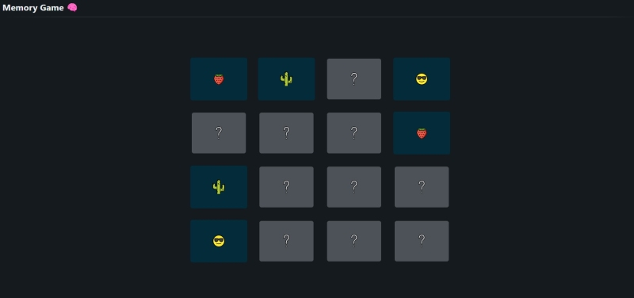

# MemoryGame

[Link to Vercel deployment](https://memory-game-one-psi.vercel.app/)

Memory Game is a React application developped as part of the fullstack web development bootcamp in La Capsule (Lyon, 2023). 
It is a remake of a memory game where the player opens pairs of tiles. If the image of the tiles match, the tiles remain open, if not - the two tiles close.
The game continues until all matching tiles open and then restarts.

Functionality available:
1. At app start 16 tiles are positioned on the screen face down
2. Clicking on a tile, it turns face up and displays an image
3. Clicking on a second tile, turns that tile face up as well. 
4. If the images of the two tiles match, they will remain face up. If not - then clicking on a third tile will turn the first two tiles face down.
5. The game continues until all tiles are turned face up. When the last tile turns up all tiles turn down and the game restarts.

Skills trained and exercised:
1. Work with UseState and UseEffect hooks
2. Use direct and inverse data flow to transfer data from parent to child components via the props variable
3. Algorythmic thinking: find solution to realize the mechanic of the game
